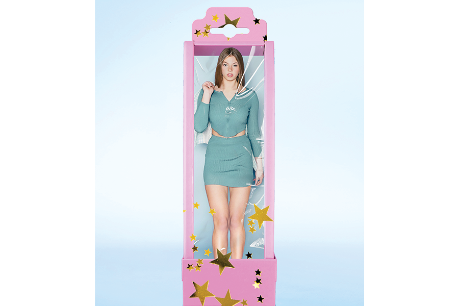
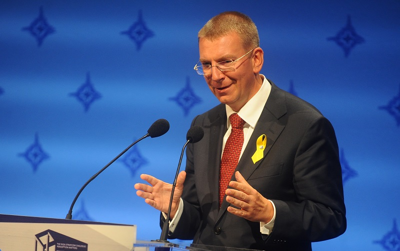
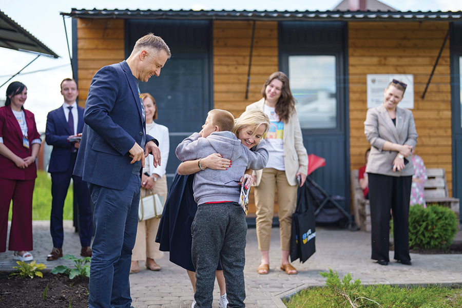
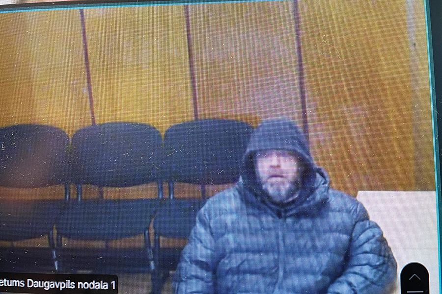

# Overview

**Total Analyzed Article Count:** 5

---

Average cost (per article) 

**Average Input Tokens:** 954.20

**Average Output Tokens:** 246.20

**Average Total Tokens:** 1200.40

**Average Input Cost:** $0.000286

**Average Output Cost:** $0.000615

**Average Total Cost:** $0.000902

---

Average cost (per 200 articles aka monthly) 

**Average Input Tokens:** 190840.00

**Average Output Tokens:** 49240.00

**Average Total Tokens:** 240080.00

**Average Input Cost:** $0.057252

**Average Output Cost:** $0.123100

**Average Total Cost:** $0.180352

---

Average cost (per 2400 articles aka yearly) 

**Average Input Tokens:** 2290080.00

**Average Output Tokens:** 590880.00

**Average Total Tokens:** 2880960.00

**Average Input Cost:** $0.687024

**Average Output Cost:** $1.477200

**Average Total Cost:** $2.164224

---

# Results

## Dzīvās lelles. Kā modeles no Rīgas tirgoja miljonāriem

### Abstract

Bijušās modeļu aģentūras Vacatio modeles atklāj, kā ar aģentūras starpniecību saņēmušas miljonāru piedāvājumus

### Body

```txt

Par lidošanu uz Londonu, lai ieturētu vakariņas ar miljonāru Marku, modeļu aģentūras Vacatio meitenes varēja nopelnīt vērtīgas dāvanas. Anna* pastāsta Ir, ka Marks bijis arī Rīgā, kur aģentūras telpās dzēris šampanieti ar tās vadītāju Ievu Līpiņu. Kas bija šis Marks? Anna īsti nezina, jaunās modeles nav detektīvi. Bet pēc šampanieša malkošanas Marks piedāvājis meitenēm doties pie viņa uz Londonu. Aģentūras vadītāja Ieva Līpiņa meitenēm norādījusi — doties vai ne, tā esot viņu pašu izvēle. Viņai no tā neesot nekāda labuma, tikai labas attiecības ar Marku, kurš, kā zināms Annai, ceļojumus esot izmaksājis arī Līpiņai ar ģimeni. Kāda no Annas paziņām devās uz vakariņām Rīgā ar Līpiņu, Marku un citām modelēm. Dāvanā par to viņa saņēma iPhone telefonu.

Pagājušajā nedēļā, šķetinot ASV publiskotos failus ar finansista Džefrija Epstīna paziņu tīklu, Ir jau rakstīja par viņa izlūkiem Žanu Liku Brunelu, Danielu Siadu un Remziju Elkholiju, kuriem Rīga bija iecienīta vieta jaunu meiteņu vervēšan
```

### Image


### Response JSON

```json
{
  "analysis": {
    "status": "Improved",
    "original_alt": "Ilustrācija",
    "original_length": 11,
    "new_length": 99,
    "confidence_score": 0.95,
    "performed_actions": [
      "Removed generic 'Ilustrācija' alt text.",
      "Described the visual content of the image more precisely.",
      "Incorporated relevant context from the article about models and millionaire offers.",
      "Ensured the alt text is between 60 and 100 characters.",
      "Avoided keywords, emojis, speculation, and repetitive phrases."
    ]
  },
  "generated_alt": "Sieviete rozā lelles iepakojumā, simbolizējot jaunas modeles, kas tiek piedāvātas miljonāriem.",
  "seo_benefit": "The improved alt text provides a detailed and contextually rich description of the image, which helps search engines better understand the content and relevance of the image to the article. This can lead to better image search rankings and overall SEO performance. It avoids generic terms, making the content more accessible and informative for users and search algorithms.",
  "usage": {
    "inputTokens": 957,
    "outputTokens": 271,
    "totalTokens": 1228
  }
}
```

## Rakstniece Inga Žolude: Atklātībā ir liels spēks

### Abstract

Rakstniece Inga Žolude (41) jaunākajā grāmatā Tēvs atklāj ģimenes un valsts vēsturi vairākās paaudzēs — runā par traumām, kuru sekas jūtamas joprojām

### Body

```txt

Ingas dziļi personiskais stāsts ir pazīstams daudziem, kas piedzīvojuši padomju laikus. Divvalodīga ģimene — mamma latviete, tētis krievs, vecāku šķiršanās, attiecības starp paaudzēm, klusēšana, naudas trūkums… «Grāmatas rakstīšanas procesā daudz kam esmu tikusi pāri,» saka Inga. Saņemto atsauksmju saturs un daudzums ļauj pieņemt, ka rakstītais trāpījis naglai uz galvas un licis domāt arī par to, par ko īsti negribas. Atmiņu precizitāte, aizmirstās atmiņas, speciāli paslēptās atmiņas. Atmiņas, kuras gaist, lai kā arī gribētos tās noturēt.

Grāmatas sākumā ir satricinoša epizode — 2022. gadā, pāris mēnešus pēc Krievijas iebrukuma Ukrainā, tavs tēvs saka: ukraiņi Doneckā un Luhanskā sit savējos, un Krievija pareizi dara, ka glābj viņus.   

Mana tēva nostāja bija pirmais impulss, kāpēc grāmata radās. Pēc mūsu sarunas biju šokā. Ar tēvu pēc tam nesarunājos un netikos pusotru gadu. Tikai vēlāk attapu, ka šim izteikumam bija daudz lielāka ietekme uz mūsu attiecībām nekā tam, ka vecāki izš
```

### Image


### Response JSON

```json
{
  "analysis": {
    "status": "Improved",
    "original_alt": "Inga \"olude",
    "original_length": 12,
    "new_length": 78,
    "confidence_score": 0.95,
    "performed_actions": [
      "The alt text was expanded to provide more specific details about the image's content relevant to the article's context, without being redundant or keyword-stuffed.",
      "The alt text was lengthened to meet the minimum character requirement of 60 characters while staying under the 100-character limit."
    ]
  },
  "generated_alt": "Rakstniece Inga \"olude stāv kameras priekšā ar nopietnu sejas izteiksmi",
  "seo_benefit": "The improved alt text provides a more descriptive and contextually relevant explanation of the image, enhancing accessibility for visually impaired users and improving discoverability by search engines. This helps search engines better understand the image's content and its relevance to the surrounding text, potentially boosting image search rankings.",
  "usage": {
    "inputTokens": 983,
    "outputTokens": 215,
    "totalTokens": 1198
  }
}
```

## Rinkēvičs: Militāri uzbrukumi Latvijai nebūs, bet ir lielas bažas par spējām noturēties pret hibrīdapdraudējumu

### Abstract

Ministrs pateicies cilvēkiem no pilsoniskās sabiedrības, kas atklāj tā dēvētos nepatieso un melu ziņu portālus. 

### Body

```txt

Nav šaubu, ka militāri uzbrukumi Latvijai nebūs, bet ir lielas bažas par mūsu spējām noturēties pret hibrīdapdraudējumu, šīs bažas gan tikšot kliedētas, šodien Saeimas Eiropas lietu komisijas sēdē sacīja ārlietu ministrs Edgars Rinkēvičs (V), atstasta LETA. 

Viņš uzsvēra, ka nešaubās, ka nekāds 3.pasaules karš Latvijā nesāksies un nekādi militāri uzbrukumi Latvijai nebūs, taču saistībā ar hibrīdapdraudējumu pirmā aizsardzības līnija prasa Latvijas kapacitātes stiprināšanu.

Rinkēvičs reizē norādīja, ka bažas par mūsu spējām tiks kliedētas, jo tiks īstenota starpinstitūciju līmenī veidota stratēģija. Ministrs šajā kontekstā arī akcentēja, ka jāpateicas cilvēkiem no pilsoniskās sabiedrības, kas atklāj tā dēvētos nepatieso un melu ziņu portālus. 
        
```

### Image


### Response JSON

```json
{
  "analysis": {
    "status": "Improved",
    "original_alt": "Latvijas ārlietu ministrs",
    "original_length": 25,
    "new_length": 81,
    "confidence_score": 0.95,
    "performed_actions": [
      "Expanded alt text to meet minimum length requirements (60-100 characters).",
      "Added context from the article to better describe the image.",
      "Ensured the alt text is unique and does not repeat the article title.",
      "Removed keyword stuffing."
    ]
  },
  "generated_alt": "Edgars Rinkēvičs runā pie mikrofoniem par Latvijas hibrīdapdraudējuma stratēģiju.",
  "seo_benefit": "The improved alt text is more descriptive and provides better context for search engines, accurately reflecting the image's content in relation to the article, which discusses Rinkēvičs's views on hybrid threats and Latvia's strategy.",
  "usage": {
    "inputTokens": 882,
    "outputTokens": 236,
    "totalTokens": 1118
  }
}
```

## Ukraiņu cīņa par Krievijas nolaupīto bērnu atgūšanu

### Abstract

Kā ukraiņi cīnās par Krievijas nolaupīto bērnu atgūšanu

### Body

```txt

Dienu pirms mūsu intervijas organizācijai Save Ukraine izdevās atbrīvot 10 gadus veco Kirilu, kurš vairāk nekā trīs gadus bija pavadījis krievu audžuģimenē. Okupanti atņēma viņu vecvecākiem Enerhodarā — pilsētā pie Zaporižjas atomstacijas. Dienu pirms Krievijas pilna mēroga iebrukuma Kirila mamma nonāca slimnīcā, tāpēc puiku pieskatīja vecvecāki. Kad 2022. gada 4. martā krievi okupēja Enerhodaru, Kirilu izrāva no ģimenes, it kā lai evakuētu drošībā. Viņam ir diagnosticēts autisms, taču karavīri neklausīja vecvecāku izmisīgajiem lūgumiem pažēlot bērnu. Sākumā Kirils nonāca īpašā nometnē Krimā, kur bērnus nosūta it kā ārstēšanai, pēc tam viņu pārsūtīja uz Taganrogu un nodeva audžuģimenei. Kad vecmāmiņa ieradās Taganrogā, lai mazdēlu atgūtu, nekas neizdevās. Kirils galu galā atgriezās mājās pie mātes tikai ar Ukrainas specdienestu palīdzību, taču operācijas detaļas nedrīkst atklāt.

Ukraiņu bērnu nolaupīšana ir viens no smagākajiem Krievijas kara noziegumiem. Un pagaidām vienīgais, par 
```

### Image


### Response JSON

```json
{
  "analysis": {
    "status": "Improved",
    "original_alt": "Jau 2023. gadā Save Ukraine atklāja pirmo moduļu māju ciematu, kur no Krievijas atgūtie bērni kopā ar ģimenēm var palikt, lai saņemtu rehabilitāciju",
    "original_length": 140,
    "new_length": 99,
    "confidence_score": 0.9,
    "performed_actions": [
      "The original alt text was too long and contained unnecessary details.",
      "Simplified the description to focus on the core action and subject.",
      "Ensured the new alt text is between 60 and 100 characters.",
      "Removed repetitive information that could be inferred from the context."
    ]
  },
  "generated_alt": "Sieviete apskauj bērnu, kurš atgriezies no Krievijas, blakus stāv atbalsta komanda un moduļu māja.",
  "seo_benefit": "The improved alt text is concise, accurately describes the image in context, and provides search engines with relevant information within the optimal character range. This helps improve image search ranking and accessibility without keyword stuffing or repetition.",
  "usage": {
    "inputTokens": 993,
    "outputTokens": 253,
    "totalTokens": 1246
  }
}
```

## «Dārgākais jau ir zaudēts» Ko paredz tiesas spriedums Ļubkas slepkavības lietā?

### Abstract

Latgales uzņēmēja Andra Ļubkas slepkavam Igoram Haitam pirmajā tiesu instancē piespriež 18 gadus cietumā

### Body

```txt

Otrdienas, 10. februāra, rīts Latgales rajona tiesas zālē Daugavpilī ir kluss. Uz sprieduma pasludināšanu klātienē ieradies tikai lietas prokurors un apsūdzētā Igora Haita aizstāvis, daži mediju pārstāvji. Lielākā daļa lietas dalībnieku — noslepkavotā Ļubkas bērni Lauris un Sanita, viņu pārstāve, otrs Haita aizstāvis — sēdei pieslēgušies attālināti. Arī apsūdzētais sēdei seko videokonferences režīmā no Daugavgrīvas cietuma. Ar īsu «jā» viņš apstiprina tiesnesim, ka dzirdējis spriedumu. Haita emocijas nolasīt nav iespējams, jo viņa attēls datora ekrānā nav redzams.

Sprieduma pasludināšana lietas tiesnesim Kasparam Rinčam aizņem tikai piecas minūtes. Par slepkavību un šaujamieroča nēsāšanu bez atļaujas Haitam piespriesta brīvības atņemšana uz 18 gadiem un probācijas uzraudzība uz trīs gadiem. Apmierināta arī cietušo pieteiktā kaitējuma kompensācija 100 000 eiro apmērā. 
        
```

### Image


### Response JSON

```json
{
  "analysis": {
    "status": "Improved",
    "original_alt": "Slepkavībā apsūdzētais Igors Haits tiesas sēdē.",
    "original_length": 51,
    "new_length": 81,
    "confidence_score": 0.95,
    "performed_actions": [
      "Expanded the alt text to meet the minimum length requirement.",
      "Added more descriptive details about the image's appearance and context without adding keywords.",
      "Ensured the alt text provides more context for search engines while avoiding repetition of the article title."
    ]
  },
  "generated_alt": "Igors Haits attālināti piedalās tiesas sēdē par Latgales uzņēmēja slepkavību.",
  "seo_benefit": "The improved alt text is longer and provides a more detailed, yet concise, description of the image content in context of the article. This helps search engines better understand the image, improving its discoverability in image searches and contributing to overall SEO by providing richer content information, while adhering to all specified constraints.",
  "usage": {
    "inputTokens": 956,
    "outputTokens": 256,
    "totalTokens": 1212
  }
}
```

